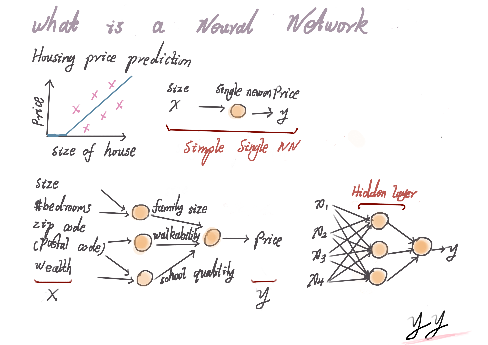

# Neural Networks and Deep Learning

## Week 1 Introduction to Deep Learning

## What is a neural network

Note: Each of the neurons of hidden layer takes all four input features. Given enough training examples with both x and y, neural networks are remarkably good at figuring out functions that accurately map from x to y. 

## Supervised Learning with Neural Networks

## Why is Deep Learning taking off?

Note: The algorithm development makes NN runs faster. e.g. Switching from Sigmoid to Relu will make gradient descent much faster. Slope of sigmoid close to 0 at some parts which will make gradient to be 0. This will result in parameters changes very slow. But if use Relu as activation function, the gradient equals to 1 for all positive values. So the gradient is much less likely to gradually shrink to 0. 

## Week 2 Neural Networks Basics

