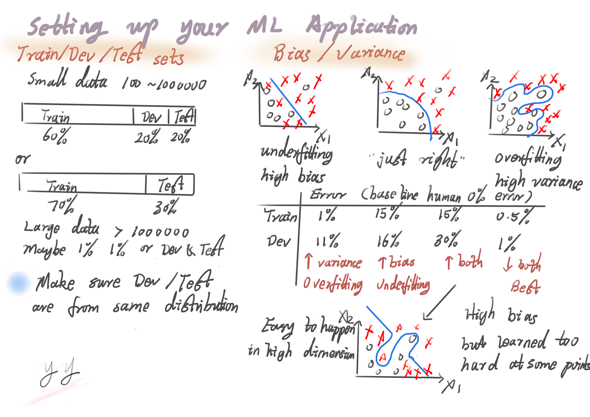
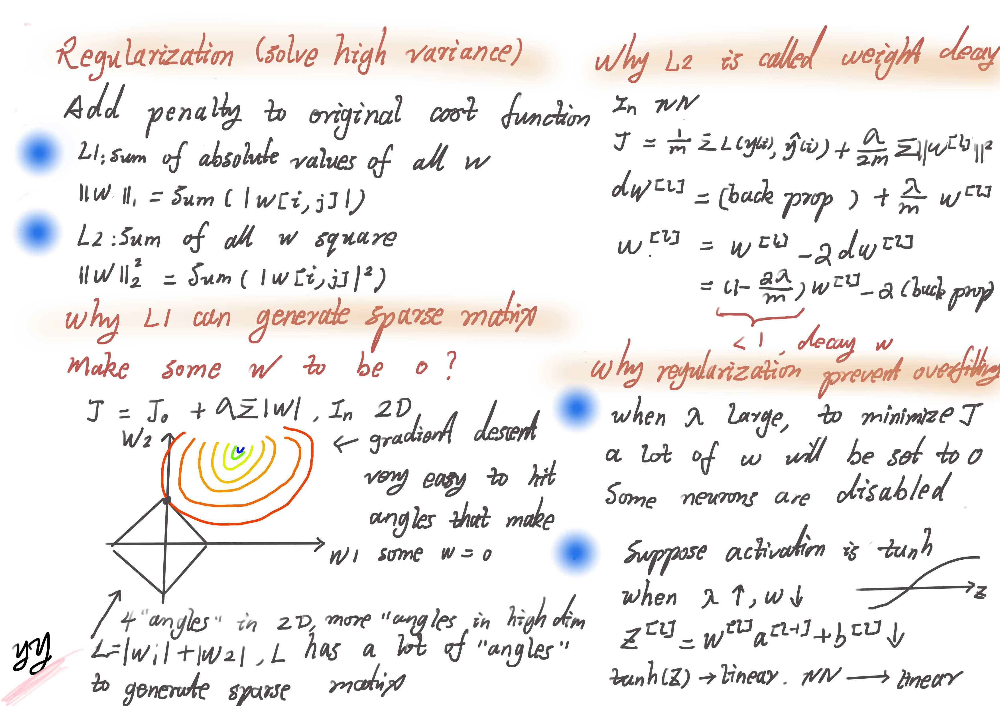
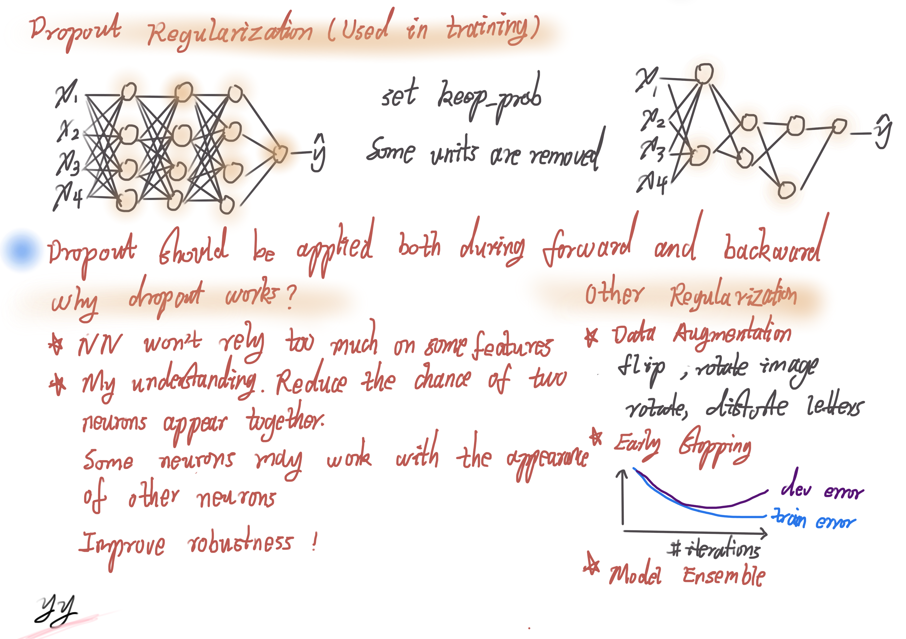
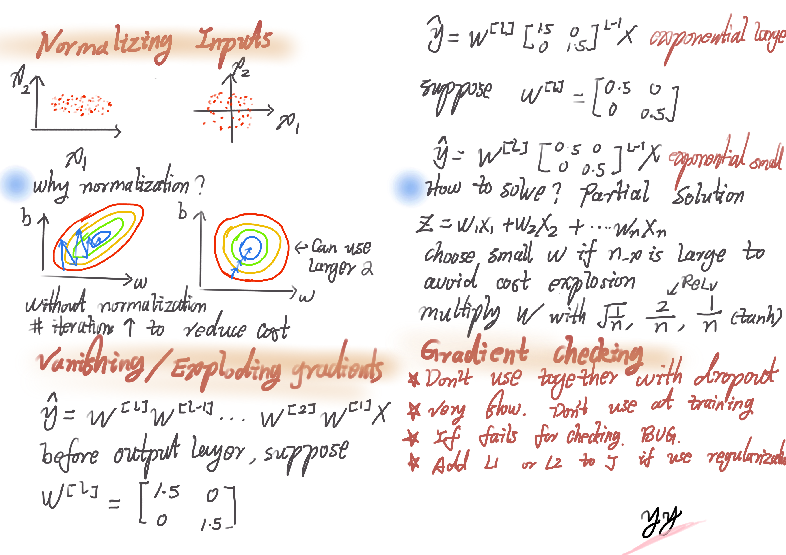
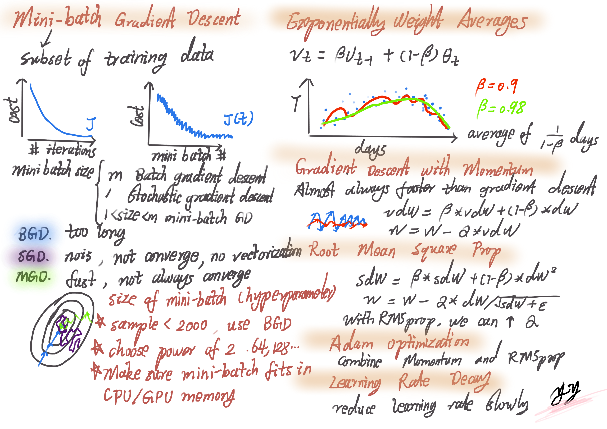
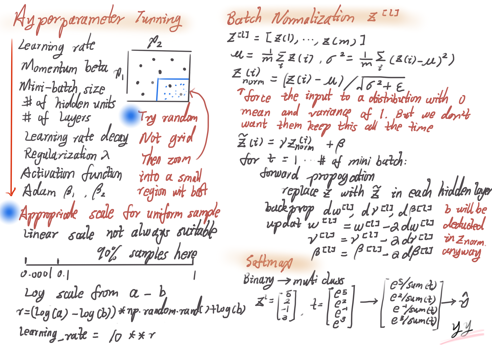

# Improving Deep Neural Networks: Hyperparameter tuning, Regularization and Optimization

## Week 1 Practical aspects of Deep Learning

## Practical aspects of Deep Learning

Note: Basic Recipe for Machine Learning

Q: When train a NN, does your algorithm has high bias (focus on training data performance)?

A: Try the following methods to get rid of the bias problem
* Try big network, such as more hidden layers or more hidden units
* Train longer
* Try some more advanced optimization algorithms
* Try different NN architecture, maybe find one that's suitable for your data

Q: Once you reduce the bias to acceptable amount, do you have high variance problem?

A: To solve high variance problem, you can try
* Get more data
* Try regularization
* Try and find proper NN architecture

"Bias variance tradeoff" exits in old days. In modern Deep Learning, getting a bigger NN will almost alwyas reduce bias without hurting variance. 

But if the image is very blurry (e.g. so blurry even human can't do a well task, the base error is too high), you may not get very good training result even if the NN is very big.   

## Regularizing your NN

Note: In practice, L2 is the most used one.

## Setting up your optimization problem 

## Week 2 Optimization algorithms

## Week 3 Hyperparameter tuning, Batch Normalization and Programming Frameworks

