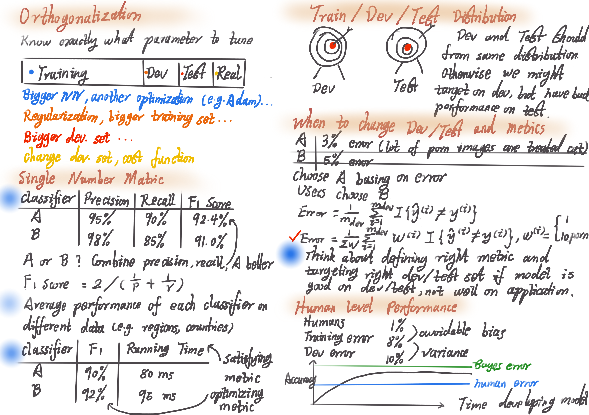
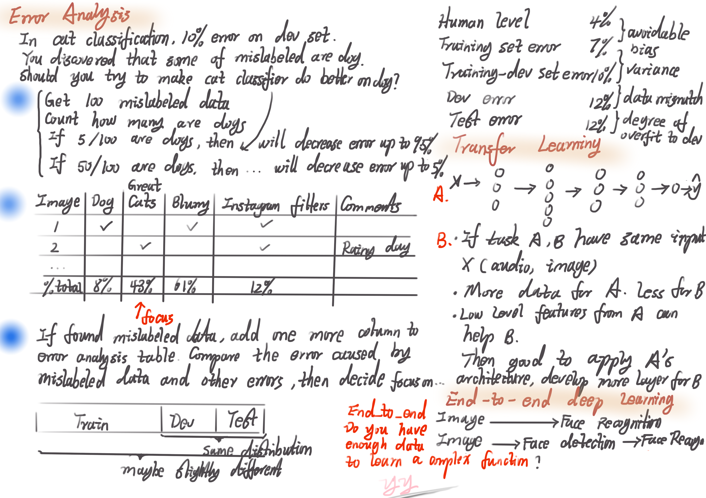

# Structuring Machine Learning Projects

## Week1 ML Strategy 1

Note: Two funtamental assumptions of supervised learning (1) our model is doing very well on training set (means we achieve low avoidable bias) and (2) training set performance generalizes well on dev/test set (low variance).

We could follow these guidelines to improve model:

1> Look at avoidable bias

2> Look at variance

3> If avoidable bias is large
* Train larger model
* Train longer time, better optimization alogirithm (Momentum, RMSprop, Adam)
* Find better NN architecture (RNN, CNN), or hyperparameter

4> If variance is large
* More training data
* Regularization (L2, dropout, data augumentation)
* Find better NN architecture (RNN, CNN), or hyperparameter

## Week2 ML Strategy 2

